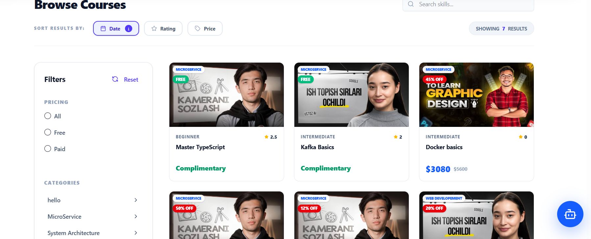
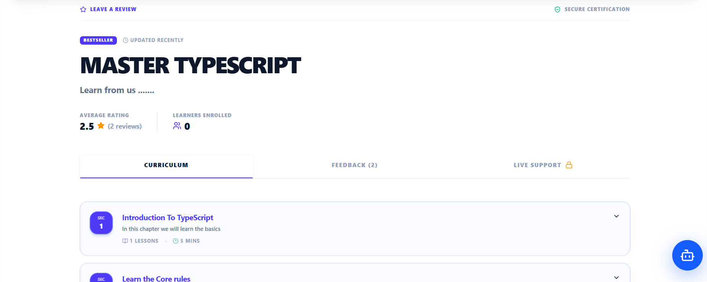
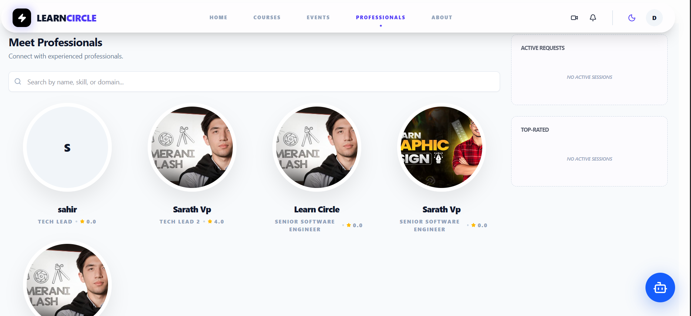
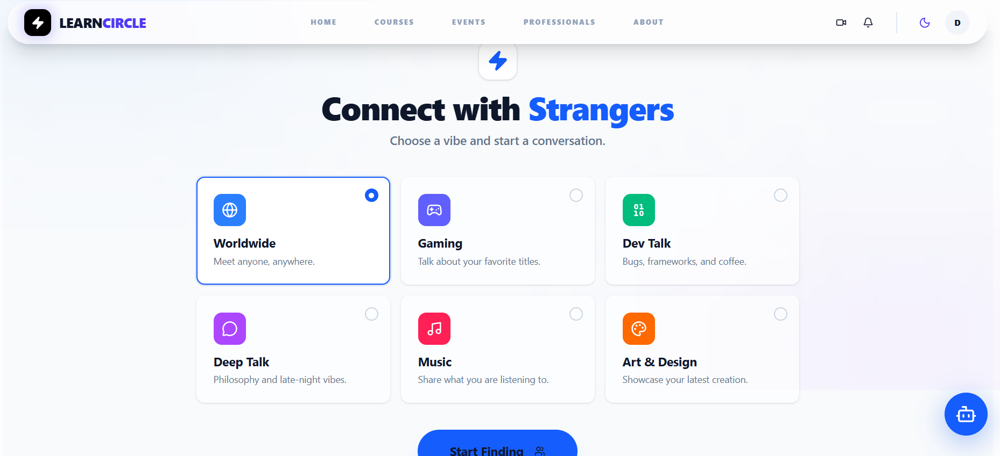
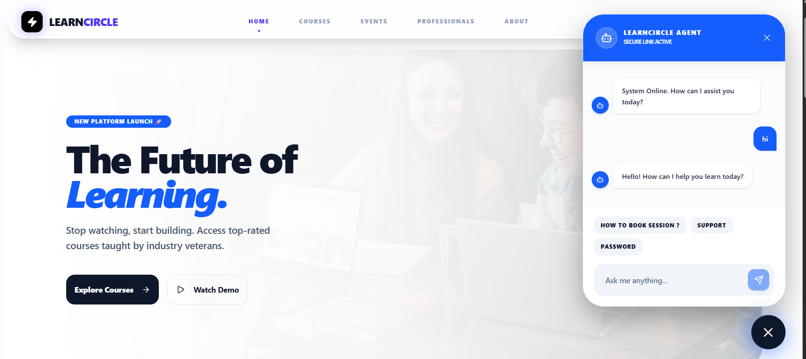
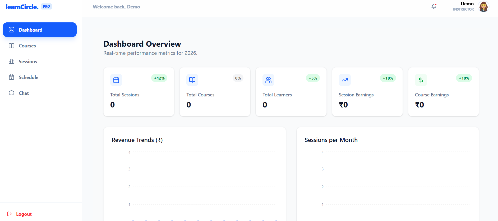
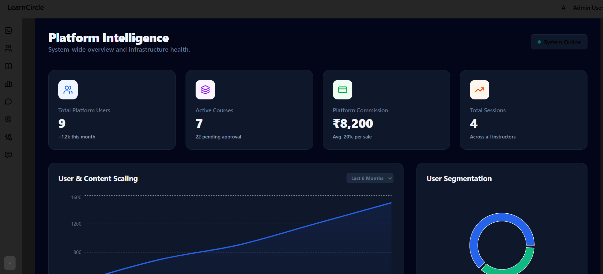

# LearnCircle

LearnCircle is a full-stack educational web application designed to provide interactive learning experiences. It features a modern, responsive frontend and a robust backend that supports real-time communication, authentication, payments, and media uploads.

## 📸 Screenshots

### Learner View
<div align="center">
  
  
</div>
<div align="center">
  
  
</div>
<div align="center">
  
</div>

### Professional View
<div align="center">
  
</div>

### Admin View
<div align="center">
  
</div>


## 🚀 Tech Stack

### Frontend
- **Framework:** React 19 (built with [Vite](https://vitejs.dev/))
- **Language:** TypeScript
- **Styling:** Tailwind CSS, Shadcn UI, Material UI (@mui/material)
- **State Management:** Redux Toolkit, Redux Persist, TanStack React Query
- **Routing:** React Router DOM
- **Form Handling & Validation:** React Hook Form, Zod
- **Animations:** Framer Motion, GSAP
- **Real-Time Communication:** Socket.io-client
- **Authentication:** Google OAuth (`@react-oauth/google`)

### Backend
- **Framework:** Express.js (Node.js)
- **Language:** TypeScript
- **Database Object Modeling:** Mongoose (MongoDB)
- **Authentication:** JWT (JSON Web Tokens), bcrypt, Google Auth Library
- **Cloud & Storage:** AWS SDK (S3, SSM)
- **Caching & Queue:** Redis
- **Real-Time Communication:** Socket.io
- **Payments:** Razorpay
- **Email:** Nodemailer
- **Logging:** Winston
- **Architecture/Patterns:** Dependency Injection with InversifyJS

## 🛠️ Prerequisites

Before you begin, ensure you have the following installed on your local machine:
- [Node.js](https://nodejs.org/) (v18 or higher recommended)
- [npm](https://www.npmjs.com/) or [yarn](https://yarnpkg.com/)
- [Docker](https://www.docker.com/) and Docker Compose (if running via containers)
- Redis server
- MongoDB server

## ⚙️ Getting Started

### 1. Clone the repository

```bash
git clone <repository-url>
cd learnCircle
```

### 2. Environment Variables

You need to set up environment variables for both the backend and frontend.

#### Backend (`/backend/.env`):
Create a `.env` file in the `backend/` directory with necessary configurations (MongoDB URI, JWT secrets, AWS credentials, Razorpay keys, Redis URL, etc.).

#### Frontend (`/frontend/.env`):
Create a `.env` file in the `frontend/` directory with necessary configurations (API base URL, Vite public keys, etc.).

### 3. Installation & Running (Using Docker)

The easiest way to get the project up and running is with Docker Compose.

```bash
docker-compose up --build
```

- **Frontend:** http://localhost:5173
- **Backend/API:** http://localhost:5000

### 4. Installation & Running (Manual / Local)

If you prefer to run the application locally without Docker:

#### Setup Backend:
```bash
cd backend
npm install
npm run dev
```

#### Setup Frontend:
```bash
cd frontend
npm install
npm run dev
```

## 📜 Scripts

### Backend (`/backend/package.json`)
- `npm run dev`: Starts the backend server in development mode using `ts-node-dev`.
- `npm run build`: Compiles the TypeScript code into the `/dist` directory.
- `npm run start`: Runs the compiled build from `/dist/server.js`.
- `npm run lint` / `npm run lint:fix`: Lints the code using ESLint.
- `npm run format`: Formats code using Prettier.

### Frontend (`/frontend/package.json`)
- `npm run dev`: Starts the Vite development server.
- `npm run build`: Builds the app for production.
- `npm run preview`: Locally preview the production build.
- `npm run lint` / `npm run lint:fix`: Lints the code using ESLint.
- `npm run format`: Formats code using Prettier.

## 📄 License
This project is licensed under the ISC License.
